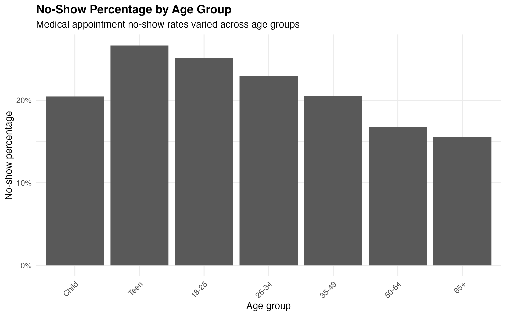
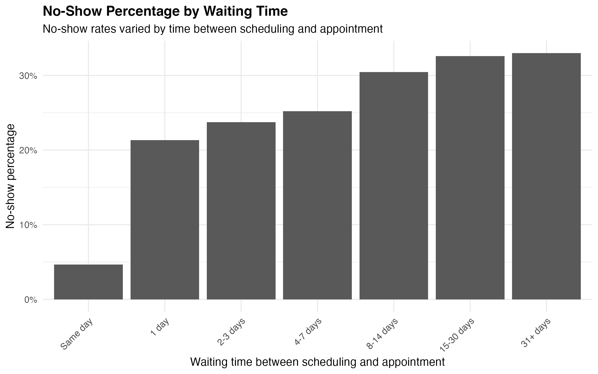
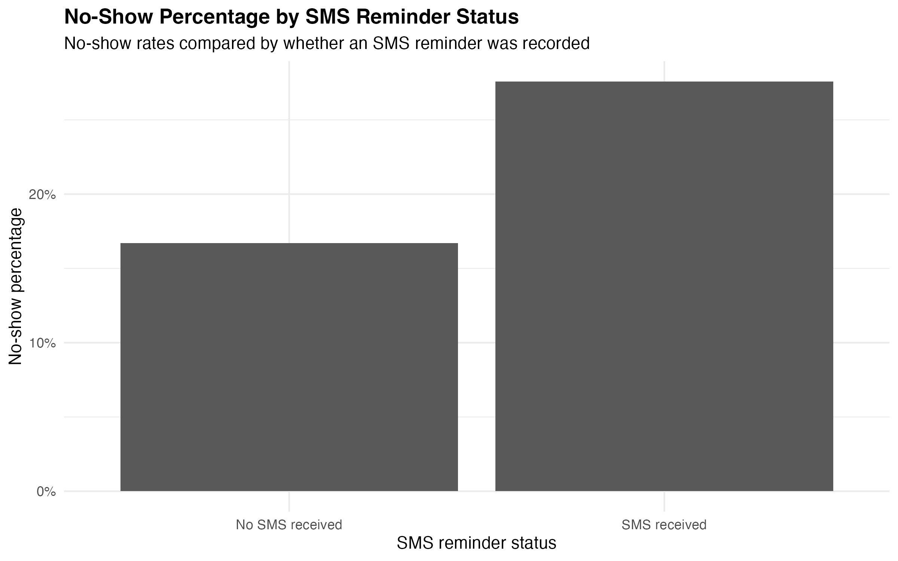
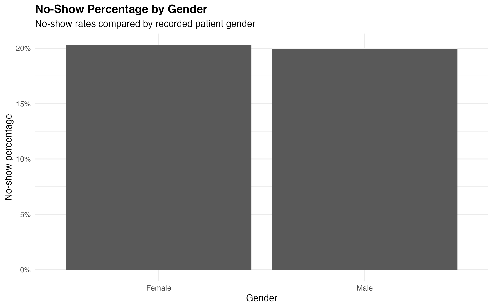
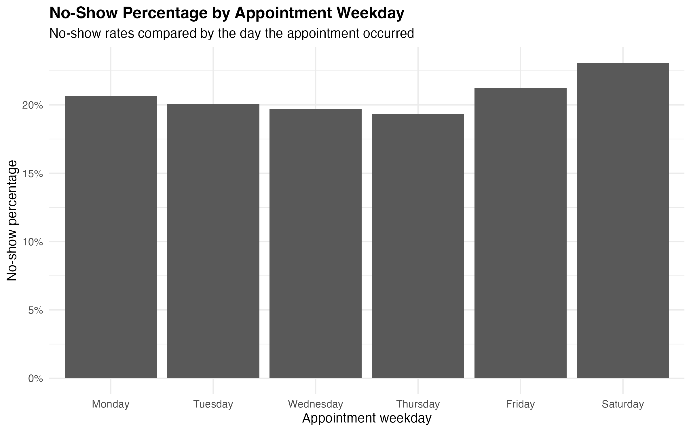
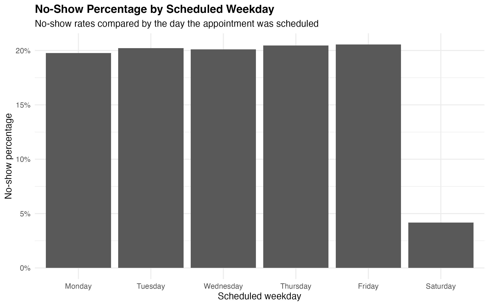
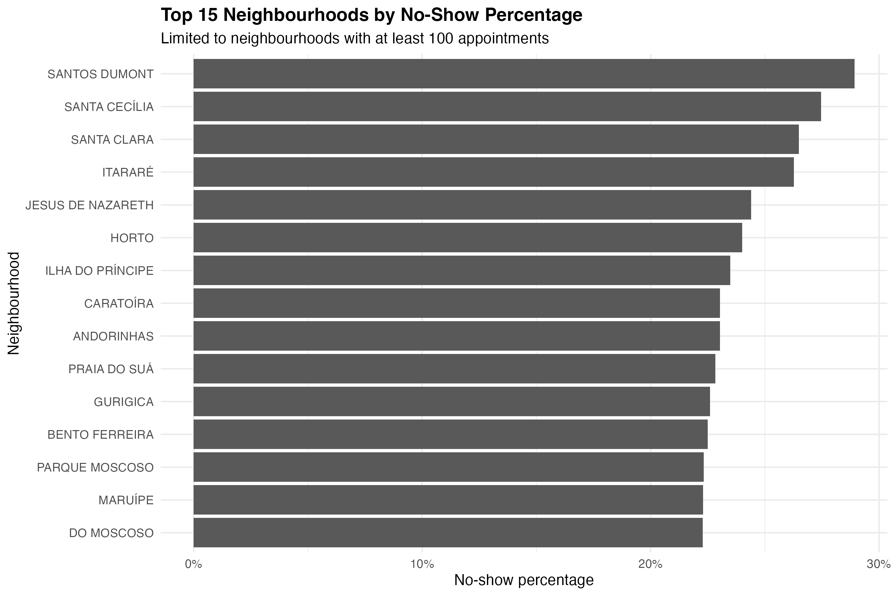

```{r setup, include=FALSE}
knitr::opts_chunk$set(echo = TRUE)
```
# Preliminary Findings

### Overall no-show rate

The overall medical appointment no-show rate was approximately 20.2%.

### Age group patterns

No-show percentages varied by age group. Teens had the highest no-show percentage, followed by patients ages 18–25 and 26–34. Older adults had the lowest no-show percentages.



### Waiting time patterns

Waiting time showed one of the clearest patterns. Same-day appointments had the lowest no-show percentage, while no-show percentages increased as the time between scheduling and the appointment became longer.



### SMS reminder pattern

Appointments with an SMS reminder recorded had a higher no-show percentage than appointments without one. 



However, this comparison is misleading, because SMS reminder status was not evenly distributed across waiting-time groups.

After comparing SMS and no-SMS appointments within the same waiting-time categories, appointments with SMS reminders generally had lower no-show percentages than appointments without SMS reminders. Same-day and one-day appointments had little or no SMS reminder representation.


This suggests that SMS reminder status should be interpreted alongside scheduling delay. The exploratory results are consistent with SMS reminders potentially being helpful, but this analysis does not prove a causal effect.

### Gender pattern

No-show percentages were very similar between female and male patients.



### Weekday patterns

Appointment weekday showed some variation, with Saturday appointments having the highest no-show percentage.



Scheduled weekday showed relatively similar no-show percentages Monday through Friday. Saturday-scheduled appointments were different, but there were only 24 appointments scheduled that day. Because of the very small denominator, this pattern was not emphasized in the dashboard.



### Neighbourhood patterns

Some neighbourhoods had higher no-show percentages than others. These findings should be interpreted carefully because no-show percentages depend on appointment volume.



### Appointment week pattern

No-show percentages were also checked by appointment week to see whether short-term calendar patterns appeared. Weekly no-show percentages did not vary enough to become a major focus of the dashboard. Because the dataset covers a short time period, stronger conclusions about seasonal patterns, holidays, or school breaks would require more months of data.

### Chronic condition count

Patients with 1–3 recorded chronic/health conditions had slightly lower no-show percentages than patients with no recorded conditions. The group with 4 recorded conditions had a higher no-show percentage, about 30.8%, but this group included only 13 appointments. Because the denominator was very small, this value was not interpreted as a stable pattern. To avoid overemphasizing an unstable subgroup, chronic condition count was kept as a secondary exploratory note rather than a main visual finding.

### Main takeaway

The strongest exploratory patterns were waiting time and age group. Longer scheduling delays were associated with higher no-show percentages, and younger patients had higher no-show percentages than older adults.

# Tableau dashboard

An interactive Tableau dashboard was created to summarize the main exploratory findings from this project.

[View the Tableau Public dashboard](https://public.tableau.com/app/profile/ver.nica.kurka/viz/MedicalAppointmentNo-ShowAnalysis_17796763435720/Dashboard1)

The dashboard focuses on appointment patterns that may help prioritize patient outreach, including waiting time, SMS reminder status, age group, weekday patterns, and neighbourhood-level appointment volume.

The dashboard also includes KPI cards for total appointments, total no-shows, overall no-show rate, and average waiting days.

# Baseline logistic regression model

A baseline logistic regression model was fit as an extension to the exploratory analysis and Tableau dashboard. The goal was to evaluate whether the main exploratory patterns remained associated with appointment no-show odds after adjustment for other variables.

The dataset was split into 80% training and 20% testing sets, stratified by no-show status. Model selection and simplification were performed using the training set only.

The final model included waiting time group, age group, SMS reminder status, gender, scholarship status, diabetes, alcoholism, handicap status, appointment weekday, and scheduled weekday.

### Model diagnostics

The final model converged successfully. Multicollinearity was assessed using VIF/GVIF values, which did not indicate meaningful multicollinearity concerns. Influence diagnostics were reviewed using Cook’s distance. Although some observations exceeded the common 4/n rule-of-thumb threshold, the maximum Cook’s distance was modest, suggesting that no single observation dominated the model estimates.

### Model findings

The strongest adjusted association was waiting time. Compared with same-day appointments, appointments scheduled farther in advance had substantially higher odds of no-show.

Younger age groups also had higher no-show odds compared with the 50–64 reference group. Teens and patients ages 18–25 had notably higher odds of no-show.

SMS reminder status was associated with lower no-show odds after adjustment. Appointments with an SMS reminder had lower odds of no-show compared with appointments with no SMS reminder recorded.

### Model performance

Prediction performance was evaluated on the held-out test set. At the default 0.50 classification threshold, the model had very low sensitivity because it rarely classified appointments as predicted no-shows. Because the project goal was potential outreach prioritization, lower thresholds were evaluated.

A 0.25 threshold provided a more useful balance, identifying about 67% of actual no-shows while maintaining about 65% specificity. Precision was modest, meaning many flagged appointments would still have shown up. This suggests the model is better suited for broad outreach prioritization than precise individual prediction.

The ROC-AUC was approximately 0.73, indicating decent discrimination for a baseline logistic regression model. Calibration by risk decile showed that predicted probabilities were reasonably aligned with observed no-show rates.

### Modeling limitations

This model identifies associations and provides baseline risk estimates, but it does not prove causation. The dataset has limited operational and clinical context, and some variables may reflect scheduling workflow rather than patient behavior alone. The model should not be used as a deployed clinical decision tool without additional validation, stakeholder review, and fairness assessment.
